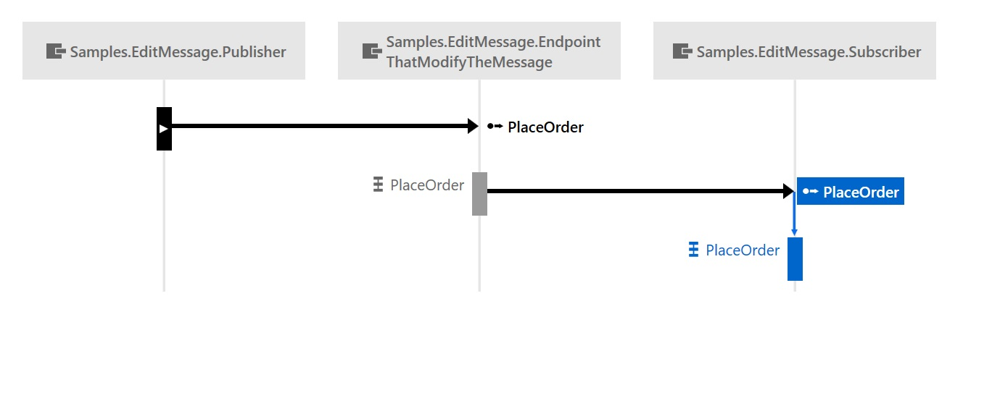

 1. Run the solution. Three console applications will start: Publisher, Subscriber and EndpointThatModifiesTheMessage.
 1. In the Publisher console window click 1 to send a command.
 1. Subscriber will receive the message and fail while trying to process it.
 1. Now in ServicePulse navigate towards Configuration screen and add Redirect from: Samples.EditMessage.Subscriber@machine-name to Samples.EditMessage.EndpointThatModifiesTheMessage@machine-name . [More information about creating Redirects](/servicepulse/redirect.md)
 1. From Service Pulse retry failed messages that were send to Subscriber. Those messages will be processed and modified by EndpointThatModifyTheMessage and send to Subscriber endpoint.

## Publisher project

A console application that send a PlaceOrder command that contains id of a user that doesn't exist.

## Subscriber project

A console application that subscribes to a PlaceOrder command and throws exception when UserId is anything different than 1.

## EndpointThatModifiesTheMessage project

A console application that subscribes to a PlaceOrder command and modify the value of UserId to 1 and sends that modified command to Subscriber endpoint.

## How it works

A publisher sends a message to a subscriber that fails to be processed. That results in that message being send to error queue and ingested by ServiceControl as a failed message. 

Creating redirect allow for a message to be retried by a different endpoint. When retrying a message in the platform a message is being send to an endpoint configured in a redirect (if present). That allows for a message to be processed by EndpointThatModifyTheMessage where the content can be modified and message be send to originating endpoint. 

